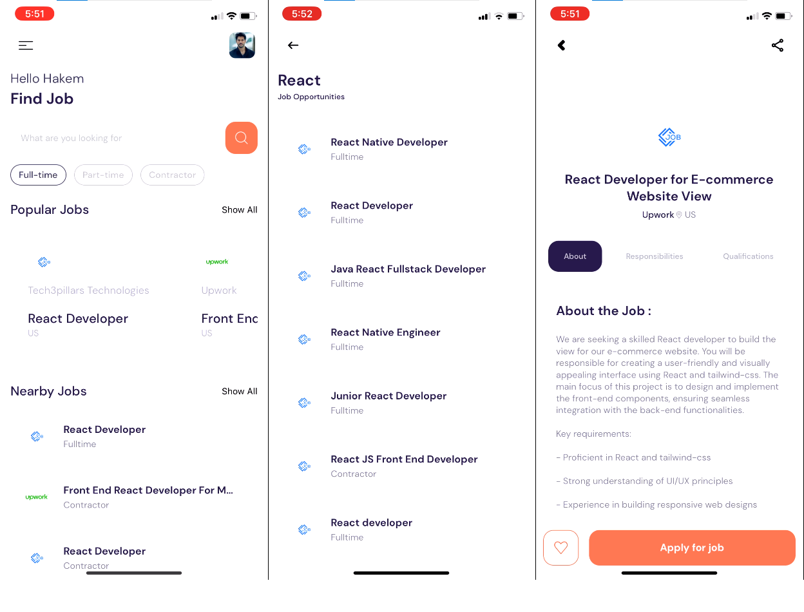

# JobFusion

JobFusion is a React Native application that helps users find new job opportunities. It utilizes the JSearch API from RapidAPI to aggregate job listings from popular job-seeking sites like LinkedIn, Glassdoor, and others, while leveraging Clerk to handle user authentification.

## Features

- **Job Aggregation**: Fetches job listings from multiple popular job-seeking sites.
- **Search Functionality**: Allows users to search for specific job listings.
- **Easy Application**: Redirects users to the respective job listing site to apply.
- **User Authentification**: Using Clerk for a secure and efficient authentification
- **User-Friendly Interface**: Simple and intuitive design for a seamless job-seeking experience.

## Screenshots

Here are some screenshots showcasing the main features of JobFusion:



## Prerequisites

Before you begin, ensure you have met the following requirements:
* You have installed the latest version of [Node.js and npm](https://nodejs.org/en/download/)

## Installation

1. Clone the repository:
   ```
   git clone https://github.com/hamdoudhakem/JobFusion.git
   ```
2. Navigate to the project directory:
   ```
   cd JobFusion
   ```
3. Install dependencies:
   ```
   npm install
   ```
4. Create a RapidAPI Account:
* Go to [RapidAPI](https://rapidapi.com/).
* Sign up for a free account (no payment card required).
* Subscribe to the free tier of the JSearch API.

5. Get Your API Key:
* Search for the JSearch API on RapidAPI.
* Copy your API key.

## Configuration

1. Create a `.env` file in the root directory of the project.
2. Add your RapidAPI key to the `.env` file:
   ```
   RAPID_API_KEY=your_api_key_here
   ```
3. Add the Clerk API key that is found inside `.env.example` to the `.env` file:
   ```
   CLERK_PUBLISHABLE_KEY=the_api_key_inside_.env.example
   ```

## Usage

Start the app by running:
```
npx expo start
```

## Troubleshooting

If you encounter a 'no data' or 'something went wrong' message when navigating to a job details page, try the following:

1. Ensure you have an active internet connection.
2. Try refreshing the page by pulling down on the screen.
3. Double-check that your RapidAPI key is correctly set in the `.env` file.
4. Verify that you're still subscribed to the JSearch API on RapidAPI.

If the issue persists, please open an issue on the GitHub repository with details about the problem you're experiencing.

## Contributing

Contributions to JobFusion are welcome. Please feel free to submit a Pull Request.

## License

This project is licensed under the MIT License.

## Contact

If you want to contact me, you can reach me at hakemhamdoud8@gmail.com.
